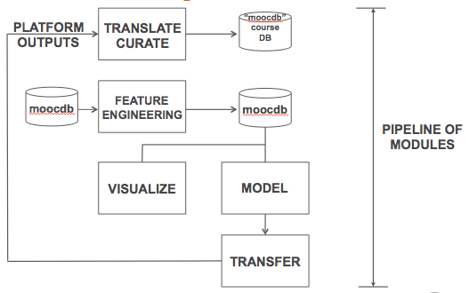
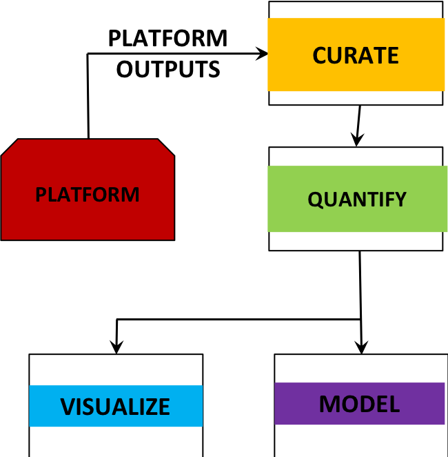
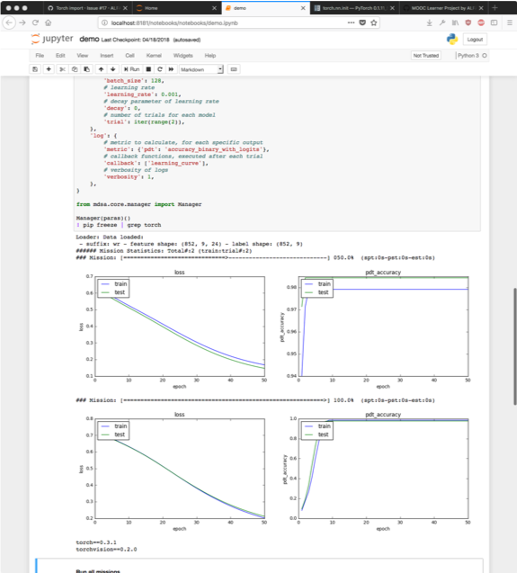

# MOOC-Learner-Project Docs

## Overview

__MOOC-Learner-Project Goal__: to enable large scale, data-driven, MOOC learning science. 

MOOC-Learner-Project provides a workflow for a researcher to work from _new observation data_ through _modeling_ to _experimentation_.

MOOC-Learner-Project has MOOC-Learner-* sub projects/repos that each address a part required for MOOC learning science.

 - MOOC learning platform captures click-stream activity, other demographic, assessment and forum and wiki activity, broadly called *platform outputs*, or *observational data*
 - there are challenges to using this data to understand teaching and learning
  - __Old observation style__  In classroom, look at teaching artifacts (notes, video of lecture), take surveys: _small sample size_, _human level variables_
  - __New observation style__ Use data science methods to analyze click-stream, large text in forums, video behavior, etc. Exploit machine learning.



## Process Notes

Since 2014 we archive MOOC-Learner-Project software, docs and web content on git.

__github.com__: used for public access.

### MOOC-Learner Project Workflows: Pipeline and Interactive

The pipeline workflow with MOOC-Learner-Pipeline follows a ”plug-in architecture”, can easily add new functions
- Curation: add patches to qpipe for different edX specifications
- Quantification: add feature extraction scripts to get new features
- Visualization: add visualization means (plot types, data post-processing methods) to generate new plots
Extensions in one pipe is independent of the others

<a href="https://github.com/MOOC-Learner-Project/MOOC-Learner-Docker"></a>

The interactive data science and analytics workflow with MOOC-Learner-Data-Science-Analytics:

<a href="https://github.com/MOOC-Learner-Project/MOOC-Learner-Data-Science-Analytics"></a>

## MOOC-Learner Curated Example

Raw data.
```
e@alfa:$ tree
.
└── 201x-2013-Spring
    └── log_data
        ├── MITx-2.01x-2013_Spring___2014_08_10___tracking_log.json.gz
        ├── MITx-2.01x-2013_Spring___2014_08_17___certificates.csv
        ├── MITx-2.01x-2013_Spring___2014_08_17___enrollment.csv
        ├── MITx-2.01x-2013_Spring___2014_08_17___forum.mongo
        ├── MITx-2.01x-2013_Spring___2014_08_17___profiles.csv
        ├── MITx-2.01x-2013_Spring___2014_08_17___studentmodule.csv
        ├── MITx-2.01x-2013_Spring___2014_08_17___user_id_map.csv
        ├── MITx-2.01x-2013_Spring___2014_08_17___users.csv
        ├── MITx-2.01x-2013_Spring___2014_08_17___wiki_article.csv
        └── MITx-2.01x-2013_Spring___2014_08_17___wiki_articlerevision.csv

2 directories, 10 files
```

Curated `MOOCdb` database.
```
e@alfa:/scratch$ mysql -u root -p 201x_2013_spring -e "SHOW TABLES;"

+----------------------------------+
| Tables_in_201x_2013_spring       |
+----------------------------------+
| agent                            |
| answers                          |
| assessments                      |
| collaboration_types              |
| collaborations                   |
| experiments                      |
| feedbacks                        |
| longitudinal_features            |
| models                           |
| observed_events                  |
| os                               |
| problem_types                    |
| problems                         |
| questions                        |
| resource_types                   |
| resources                        |
| resources_urls                   |
| submissions                      |
| surveys                          |
| urls                             |
| user_longitudinal_feature_values |
| users                            |
+----------------------------------+
```

```
e@alfa:/scratch$ mysql -u root -p 201x_2013_spring -e "SELECT COUNT(*) FROM users;"

+----------+
| COUNT(*) |
+----------+
|    34834 |
+----------+
```
